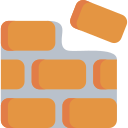

# The Brick Project

A simple Java-based game inspired from the original "Breakout".

This game was done for a school project during my IT course with some classmates.

## What we used

- **Maven**: to manage all external packages and project compilations
- **Git**: to manage our team work project
- **Java Swing & Graphics**: to draw the entire graphic of the game
- **JSON Files**: to store levels and users data

## Notes

`This program need to be compiled and run with **JAVA 17**.`

## Contributing

Feel free to fork and made a better version of it!

## License
[GNU General Public License v3.0](https://github.com/MichaelCasaDev/The-Brick-Project/blob/main/LICENSE)
